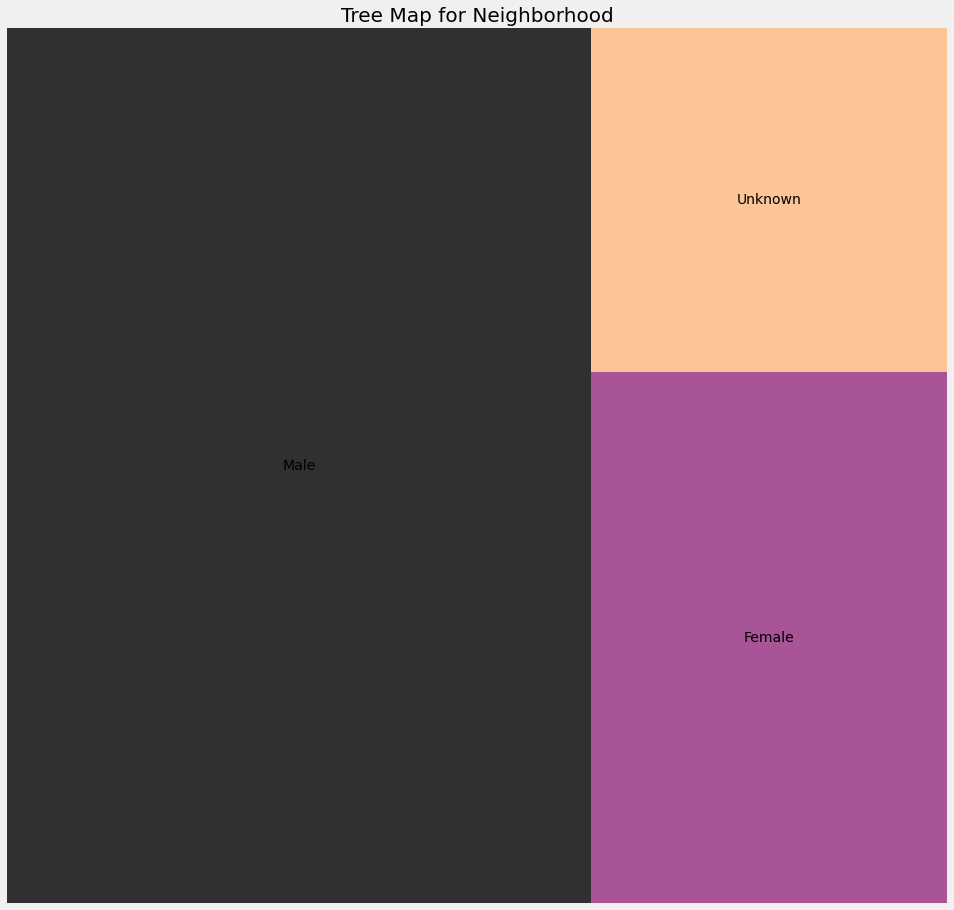

```python
import pandas as pd
import numpy as np
import matplotlib.pyplot as plt
import seaborn as sns
import squarify
%matplotlib inline
```


```python
mpls= pd.read_csv ('MplsStops.csv', index_col = 'Unnamed: 0', parse_dates = ['date'])
mpls.head()
```


<div>
<style scoped>
    .dataframe tbody tr th:only-of-type {
        vertical-align: middle;
    }

    .dataframe tbody tr th {
        vertical-align: top;
    }

    .dataframe thead th {
        text-align: right;
    }
</style>
<table border="1" class="dataframe">
  <thead>
    <tr style="text-align: right;">
      <th></th>
      <th>idNum</th>
      <th>date</th>
      <th>problem</th>
      <th>MDC</th>
      <th>citationIssued</th>
      <th>personSearch</th>
      <th>vehicleSearch</th>
      <th>preRace</th>
      <th>race</th>
      <th>gender</th>
      <th>lat</th>
      <th>long</th>
      <th>policePrecinct</th>
      <th>neighborhood</th>
    </tr>
  </thead>
  <tbody>
    <tr>
      <th>6823</th>
      <td>17-000003</td>
      <td>2017-01-01 00:00:42</td>
      <td>suspicious</td>
      <td>MDC</td>
      <td>NaN</td>
      <td>NO</td>
      <td>NO</td>
      <td>Unknown</td>
      <td>Unknown</td>
      <td>Unknown</td>
      <td>44.966617</td>
      <td>-93.246458</td>
      <td>1</td>
      <td>Cedar Riverside</td>
    </tr>
    <tr>
      <th>6824</th>
      <td>17-000007</td>
      <td>2017-01-01 00:03:07</td>
      <td>suspicious</td>
      <td>MDC</td>
      <td>NaN</td>
      <td>NO</td>
      <td>NO</td>
      <td>Unknown</td>
      <td>Unknown</td>
      <td>Male</td>
      <td>44.980450</td>
      <td>-93.271340</td>
      <td>1</td>
      <td>Downtown West</td>
    </tr>
    <tr>
      <th>6825</th>
      <td>17-000073</td>
      <td>2017-01-01 00:23:15</td>
      <td>traffic</td>
      <td>MDC</td>
      <td>NaN</td>
      <td>NO</td>
      <td>NO</td>
      <td>Unknown</td>
      <td>White</td>
      <td>Female</td>
      <td>44.948350</td>
      <td>-93.275380</td>
      <td>5</td>
      <td>Whittier</td>
    </tr>
    <tr>
      <th>6826</th>
      <td>17-000092</td>
      <td>2017-01-01 00:33:48</td>
      <td>suspicious</td>
      <td>MDC</td>
      <td>NaN</td>
      <td>NO</td>
      <td>NO</td>
      <td>Unknown</td>
      <td>East African</td>
      <td>Male</td>
      <td>44.948360</td>
      <td>-93.281350</td>
      <td>5</td>
      <td>Whittier</td>
    </tr>
    <tr>
      <th>6827</th>
      <td>17-000098</td>
      <td>2017-01-01 00:37:58</td>
      <td>traffic</td>
      <td>MDC</td>
      <td>NaN</td>
      <td>NO</td>
      <td>NO</td>
      <td>Unknown</td>
      <td>White</td>
      <td>Female</td>
      <td>44.979078</td>
      <td>-93.262076</td>
      <td>1</td>
      <td>Downtown West</td>
    </tr>
  </tbody>
</table>
</div>


```python
# plotting a tree map
# race_count = mpls.groupby(['race'])['idNum'].count().reset_index(name='counts').sort_values(by='counts',ascending=False)
# y = race_count['counts']
y = mpls['neighborhood'].value_counts().head(25)
    
plt.rcParams['figure.figsize'] = (15, 15)
plt.style.use('fivethirtyeight')

color = plt.cm.magma(np.linspace(0, 1, 20))
squarify.plot(sizes = y.values, label = y.index, alpha=.8, color = color)
plt.title('Tree Map for Neighborhood', fontsize = 20)

plt.axis('off')
plt.show()
```





```python
problem_race = mpls.groupby(['problem','race'])['idNum'].count().reset_index(name='counts').sort_values(by='counts',ascending=False)
problem_race
# # Regions with count of crimes

# plt.style.use('seaborn')

# problem_race['problem'].value_counts().head(15).plot.pie(figsize = (15, 8), explode = (0.1, 0.1, 0.1, 0.1, 0.1, 0.1, 0.1, 0.1))
# plt.title('Stop Count BAsed On Race',fontsize = 20)
# plt.xticks(rotation = 90)
# plt.show()
suspicious = mpls[mpls["problem"]=='suspicious']
```


```python
# Regions with count of crimes

plt.style.use('seaborn')

suspicious['race'].value_counts().head(15).plot.pie(figsize = (15, 8), explode = (0.1, 0.1, 0.1, 0.1, 0.1, 0.1, 0.1, 0.1))
plt.title('Stop Count Based On Race',fontsize = 20)
plt.xticks(rotation = 90)
plt.show()
```


```python
# Regions with count of crimes

plt.style.use('seaborn')

mpls['race'].value_counts().head(15).plot.pie(figsize = (15, 8), explode = (0.1, 0.1, 0.1, 0.1, 0.1, 0.1, 0.1, 0.1))
plt.title('Stop Count BAsed On Race',fontsize = 20)
plt.xticks(rotation = 90)
plt.show()
```


```python
mpls.dtypes
```


    Unnamed: 0                 int64
    idNum                     object
    date              datetime64[ns]
    problem                   object
    MDC                       object
    citationIssued            object
    personSearch              object
    vehicleSearch             object
    preRace                   object
    race                      object
    gender                    object
    lat                      float64
    long                     float64
    policePrecinct             int64
    neighborhood              object
    dtype: object


```python
#number of male and female that were stopped  by the Minneapolis Police Department for the year 2017
#Here I want to know what type of arrays does the gender column in my dataset contains
mpls.gender.unique()
#output array(['Unknown', 'Male', 'Female', nan], dtype=object)
```


    array(['Unknown', 'Male', 'Female', nan], dtype=object)


```python
#To know how much of each type we have
mpls.gender.value_counts()
#output Male       27131
# Female     10015
# Unknown     6492
# Name: gender, dtype: int64
```


    Male       27131
    Female     10015
    Unknown     6492
    Name: gender, dtype: int64


```python
mpls.problem.value_counts()
```


    traffic       23199
    suspicious    20439
    Name: problem, dtype: int64


```python
t = mpls.PdDistrict.value_counts()

table = pd.DataFrame(data=t.values, index=t.index, columns=['Count'])
table = table.reindex(["CENTRAL", "NORTHERN", "PARK", "SOUTHERN", "MISSION", "TENDERLOIN", "RICHMOND", "TARAVAL", "INGLESIDE", "BAYVIEW"])

table = table.reset_index()
table.rename({'index': 'Neighborhood'}, axis='columns', inplace=True)

table
```


```python
t = mpls.neighborhood.value_counts()

table = pd.DataFrame(data=t.values, index=t.index, columns=['Count'])
# table = table.reindex(["CENTRAL", "NORTHERN", "PARK", "SOUTHERN", "MISSION", "TENDERLOIN", "RICHMOND", "TARAVAL", "INGLESIDE", "BAYVIEW"])

table = table.reset_index()
table.rename({'index': 'Neighborhood'}, axis='columns', inplace=True)
#generate map
sf_map.choropleth(
    geo_data=gjson,
    data=table,
    columns=['Neighborhood', 'Count'],
    key_on='feature.properties.DISTRICT',
    fill_color='YlOrRd', 
    fill_opacity=0.7, 
    line_opacity=0.2,
    legend_name='Crime Rate in San Francisco'
)

sf_map
```


<div>
<style scoped>
    .dataframe tbody tr th:only-of-type {
        vertical-align: middle;
    }

    .dataframe tbody tr th {
        vertical-align: top;
    }

    .dataframe thead th {
        text-align: right;
    }
</style>
<table border="1" class="dataframe">
  <thead>
    <tr style="text-align: right;">
      <th></th>
      <th>Neighborhood</th>
      <th>Count</th>
    </tr>
  </thead>
  <tbody>
    <tr>
      <th>0</th>
      <td>Downtown West</td>
      <td>4409</td>
    </tr>
    <tr>
      <th>1</th>
      <td>Whittier</td>
      <td>3328</td>
    </tr>
    <tr>
      <th>2</th>
      <td>Near - North</td>
      <td>2256</td>
    </tr>
    <tr>
      <th>3</th>
      <td>Lyndale</td>
      <td>2154</td>
    </tr>
    <tr>
      <th>4</th>
      <td>Jordan</td>
      <td>2075</td>
    </tr>
    <tr>
      <th>...</th>
      <td>...</td>
      <td>...</td>
    </tr>
    <tr>
      <th>82</th>
      <td>Morris Park</td>
      <td>74</td>
    </tr>
    <tr>
      <th>83</th>
      <td>Hale</td>
      <td>61</td>
    </tr>
    <tr>
      <th>84</th>
      <td>Page</td>
      <td>41</td>
    </tr>
    <tr>
      <th>85</th>
      <td>Camden Industrial</td>
      <td>34</td>
    </tr>
    <tr>
      <th>86</th>
      <td>Humboldt Industrial Area</td>
      <td>10</td>
    </tr>
  </tbody>
</table>
<p>87 rows × 2 columns</p>
</div>


```python
mpls = mpls.dropna(how='any', subset=['citationIssued'])
```


    <bound method IndexOpsMixin.value_counts of 36569     NO
    36573     NO
    36585     NO
    36593     NO
    36595     NO
            ... 
    60834    YES
    60835     NO
    60836     NO
    60837     NO
    60838     NO
    Name: citationIssued, Length: 19110, dtype: object>


```python
mpls_citation = mpls[mpls["citationIssued"]=='YES']
```


```python
# Regions with count of crimes

plt.style.use('seaborn')

mpls['race'].value_counts().head(15).plot.pie(figsize = (15, 8), explode = (0.1, 0.1, 0.1, 0.1, 0.1, 0.1, 0.1, 0.1))
plt.title('Stop Count BAsed On Race',fontsize = 20)
plt.xticks(rotation = 90)
plt.show()
```


```python
# Regions with count of crimes

plt.style.use('seaborn')

mpls_citation['race'].value_counts().head(15).plot.pie(figsize = (15, 8), explode = (0.1, 0.1, 0.1, 0.1, 0.1, 0.1, 0.1, 0.1))
plt.title('Stop Count BAsed On Race',fontsize = 20)
plt.xticks(rotation = 90)
plt.show()
```


