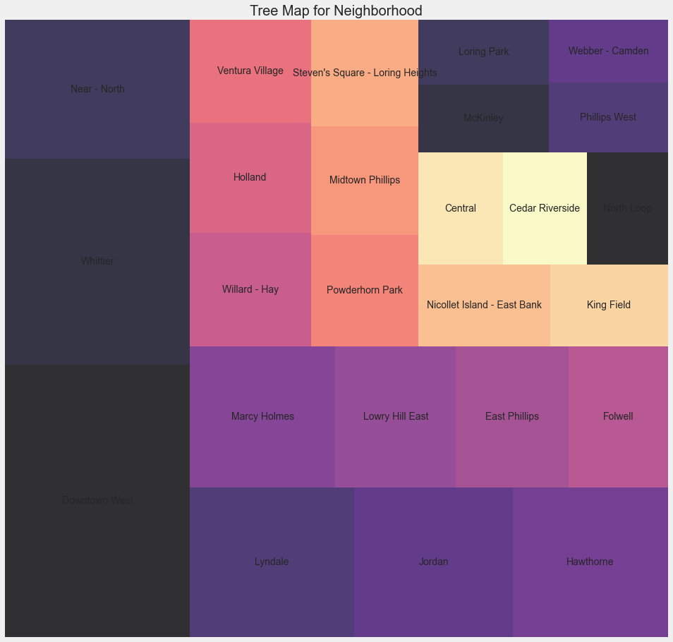
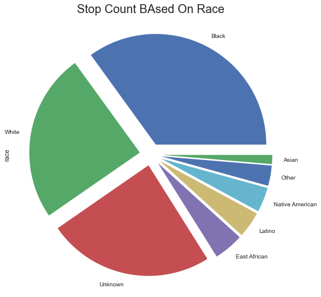
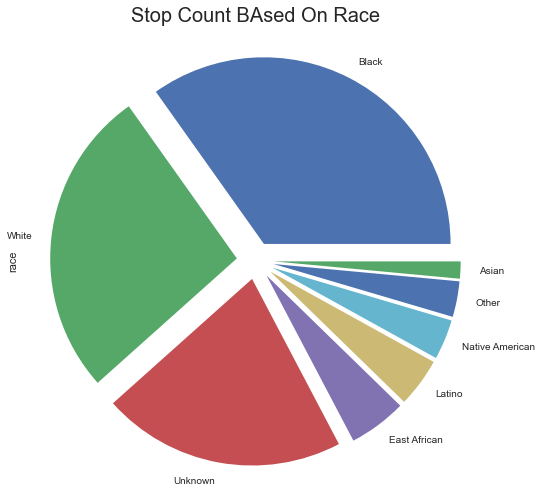

# exploratory_data_analysis
This repository is to share the exploratory data analysis
```python
import pandas as pd
import numpy as np
import matplotlib.pyplot as plt
import seaborn as sns
import squarify
%matplotlib inline
```


```python
mpls= pd.read_csv ('MplsStops.csv', index_col = 'Unnamed: 0', parse_dates = ['date'])
mpls.head()
```


<div>
<style scoped>
    .dataframe tbody tr th:only-of-type {
        vertical-align: middle;
    }

    .dataframe tbody tr th {
        vertical-align: top;
    }

    .dataframe thead th {
        text-align: right;
    }
</style>
<table border="1" class="dataframe">
  <thead>
    <tr style="text-align: right;">
      <th></th>
      <th>idNum</th>
      <th>date</th>
      <th>problem</th>
      <th>MDC</th>
      <th>citationIssued</th>
      <th>personSearch</th>
      <th>vehicleSearch</th>
      <th>preRace</th>
      <th>race</th>
      <th>gender</th>
      <th>lat</th>
      <th>long</th>
      <th>policePrecinct</th>
      <th>neighborhood</th>
    </tr>
  </thead>
  <tbody>
    <tr>
      <th>6823</th>
      <td>17-000003</td>
      <td>2017-01-01 00:00:42</td>
      <td>suspicious</td>
      <td>MDC</td>
      <td>NaN</td>
      <td>NO</td>
      <td>NO</td>
      <td>Unknown</td>
      <td>Unknown</td>
      <td>Unknown</td>
      <td>44.966617</td>
      <td>-93.246458</td>
      <td>1</td>
      <td>Cedar Riverside</td>
    </tr>
    <tr>
      <th>6824</th>
      <td>17-000007</td>
      <td>2017-01-01 00:03:07</td>
      <td>suspicious</td>
      <td>MDC</td>
      <td>NaN</td>
      <td>NO</td>
      <td>NO</td>
      <td>Unknown</td>
      <td>Unknown</td>
      <td>Male</td>
      <td>44.980450</td>
      <td>-93.271340</td>
      <td>1</td>
      <td>Downtown West</td>
    </tr>
    <tr>
      <th>6825</th>
      <td>17-000073</td>
      <td>2017-01-01 00:23:15</td>
      <td>traffic</td>
      <td>MDC</td>
      <td>NaN</td>
      <td>NO</td>
      <td>NO</td>
      <td>Unknown</td>
      <td>White</td>
      <td>Female</td>
      <td>44.948350</td>
      <td>-93.275380</td>
      <td>5</td>
      <td>Whittier</td>
    </tr>
    <tr>
      <th>6826</th>
      <td>17-000092</td>
      <td>2017-01-01 00:33:48</td>
      <td>suspicious</td>
      <td>MDC</td>
      <td>NaN</td>
      <td>NO</td>
      <td>NO</td>
      <td>Unknown</td>
      <td>East African</td>
      <td>Male</td>
      <td>44.948360</td>
      <td>-93.281350</td>
      <td>5</td>
      <td>Whittier</td>
    </tr>
    <tr>
      <th>6827</th>
      <td>17-000098</td>
      <td>2017-01-01 00:37:58</td>
      <td>traffic</td>
      <td>MDC</td>
      <td>NaN</td>
      <td>NO</td>
      <td>NO</td>
      <td>Unknown</td>
      <td>White</td>
      <td>Female</td>
      <td>44.979078</td>
      <td>-93.262076</td>
      <td>1</td>
      <td>Downtown West</td>
    </tr>
  </tbody>
</table>
</div>


```python
# plotting a tree map
# race_count = mpls.groupby(['race'])['idNum'].count().reset_index(name='counts').sort_values(by='counts',ascending=False)
# y = race_count['counts']
y = mpls['gender'].value_counts().head(25)
    
plt.rcParams['figure.figsize'] = (15, 15)
plt.style.use('fivethirtyeight')

color = plt.cm.magma(np.linspace(0,6, 15))
squarify.plot(sizes = y.values, label = y.index, alpha=.8, color = color)
plt.title('Tree Map for Neighborhood', fontsize = 20)

plt.axis('off')
plt.show()
```





```python
# Regions with count of crimes

plt.style.use('seaborn')

mpls['race'].value_counts().head(15).plot.pie(figsize = (15, 8), explode = (0.1, 0.1, 0.1, 0.1, 0.1, 0.1, 0.1, 0.1))
plt.title('Stop Count BAsed On Race',fontsize = 20)
plt.xticks(rotation = 90)
plt.show()
```





Investigate the effect of race on issued citations


```python
mpls_citation = mpls[mpls["citationIssued"]=='YES']

plt.style.use('seaborn')

mpls_citation['race'].value_counts().head(15).plot.pie(figsize = (15, 8), explode = (0.1, 0.1, 0.1, 0.1, 0.1, 0.1, 0.1, 0.1))
plt.title('Stop Count BAsed On Race',fontsize = 20)
plt.xticks(rotation = 90)
plt.show()
```





```python

```
